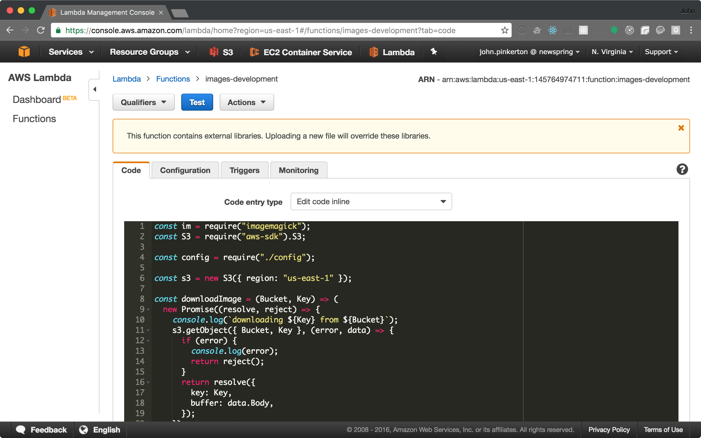
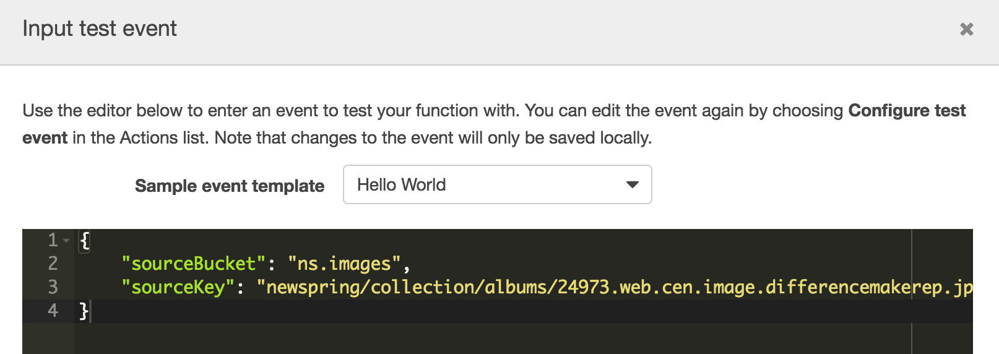
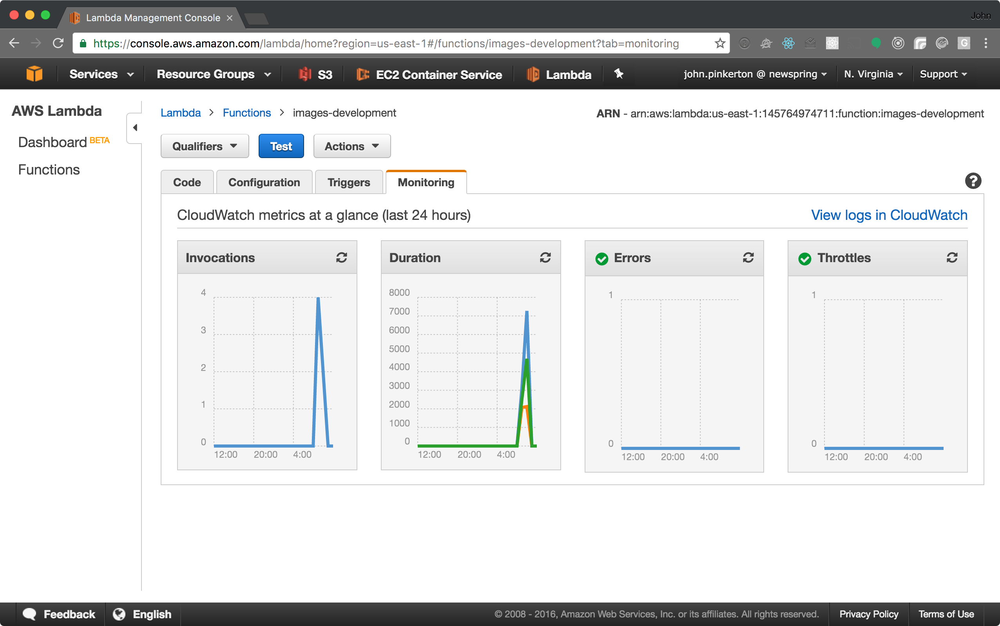
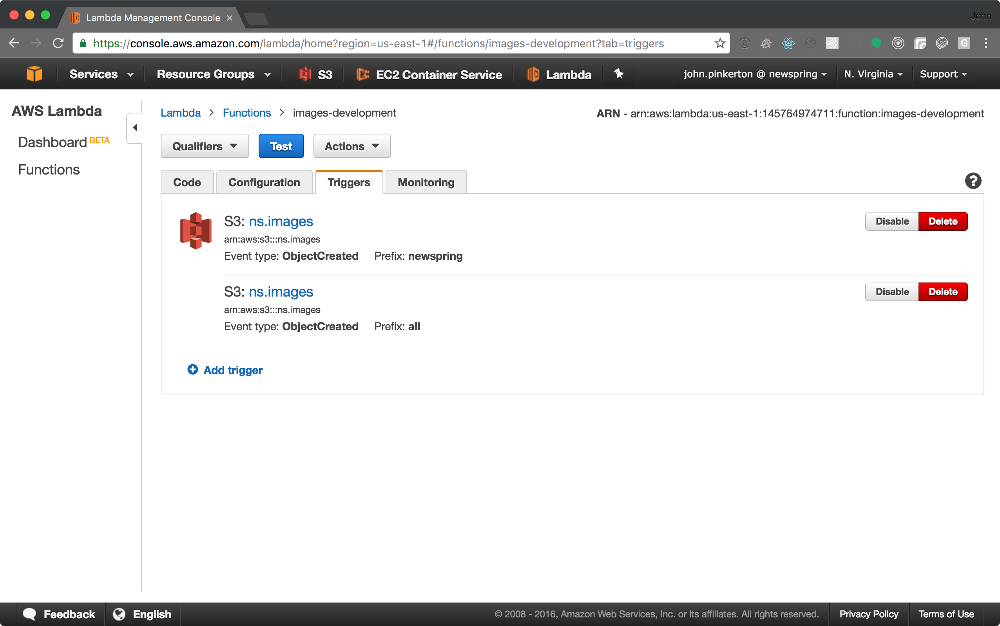

# Readme

This project is used for taking an image that already exists in an AWS S3 bucket, generating several different compressed and resized versions of the image, and then uploading the new images to a different S3 bucket. Here are the different ways you may wish to run this project:

1. Locally
2. Manually on AWS Lambda
3. Automatically triggered on AWS Lambda
4. Batch process with the [batcher](NewSpring/batcher)

## Local Development

You may need to install ImageMagick if it's not already installed on your machine:

```bash
brew install imagemagick
```

After installing the dependencies (`npm install`), you will need to grab you AWS credentials using AWS IAM and place them in `~/.aws/credentials` like this:

```bash
[default]

aws_access_key_id = your_access_key
aws_secret_access_key = your_secret_key
```

Then you will need to supply a bucket and S3 key for the source item. You can do this in `context.json`:

```json
{
  "sourceBucket": "ns.images",
  "sourceKey": "path/to/image.jpg"
}
```

The image sizes, and the target bucket can be edited in `config.json`, but defaults to:

```json
{
  "bucket": "resizings",
  "resizes": [
    {
      "size": 20,
      "name": "xsmall"
    },
    {
      "size": 100,
      "name": "small"
    },
    {
      "size": 500,
      "name": "medium"
    },
    {
      "size": 1000,
      "name": "large"
    }
  ]
}
```

Now, you can run `npm start`, and the image specified in `context.json` will be downloaded, resized according to `config.json`, and uploaded to the bucket specified in `config.json`.

## Manually on AWS Lambda

To deploy a new version of the project, you can use `npm run deploy`. This will package up the project and it's dependencies, and deploy it on Lambda.

Login to the AWS console, click on "Lambda", then on "images-development", and you should see something like this:



*DO NOT EDIT THE CODE ON AWS*

It won't work, since we use external dependencies, they will be lost.

You can configure the context, just like local development, by clicking on "Actions", then "Configure test event".



Then, you can click "Save and Test" in the bottom right to run the lambda function. It will spit out any errors that may happen. The "Monitoring" tab is a good place to see what's going on.



## Automatically Triggered on Lambda

AWS Lambda has a triggering system that allows you to trigger your function when some other thing happens on AWS. Currently, it is being used to automatically trigger this function any time an image is uploaded to the `ns.images` bucket.

You can edit triggers by clicking "Triggers".



Automatically triggered actions do not pass the image and bucket as context, like when we trigger it locally or manually on AWS. We handle this in code like this:

```js
const sourceBucket = event.sourceBucket || event.Records[0].s3.bucket.name;
const sourceKey = event.sourceKey || event.Records[0].s3.object.key;
```

## Batch Processing

In order to batch process all images in a bucket, use the [batcher](NewSpring/batcher) tool. More info can be found there.

## Known Issues

#### Timeouts

The lambda function will timeout every once in a while when automatically triggered by S3. The exact issue hasn't been identified yet, but it seems to have something to do with the amount of RAM allocated to the function. Maxing out the RAM (1536mb) on Lambda as fixed many of the timeouts. The timeout is currently set to 60 seconds. I'm not sure if allowing more than 60 seconds will fix the issue. I doubt it. I think it just has to do with processing specific types of images.

It has been easy enough to manually process images which time out, but it may be worth setting up error monitoring so that we can manually process images before they manifest in the app.
